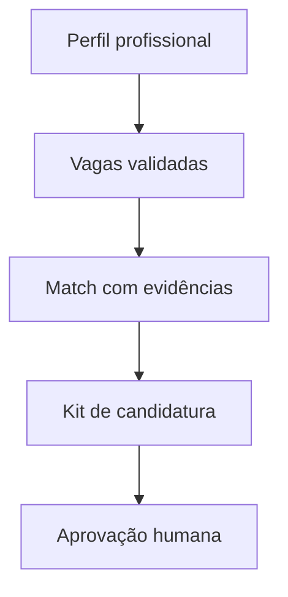

# CareerOps AI

O **CareerOps AI** é a evolução pública do protótipo VagaTrace AI: um workflow de agente de IA para estruturar perfis profissionais, pesquisar e validar vagas, calcular aderência com evidências e preparar materiais personalizados de candidatura.

O projeto foi construído como um conjunto de cinco skills especializadas, com regras explícitas, validação determinística em Python e aprovação humana antes de qualquer ação sensível.

> Status: MVP educacional e de portfólio. Não é um SaaS e não envia candidaturas automaticamente.

## Problema

Processos de recolocação podem misturar dados, usar vagas encerradas, inventar informações ausentes ou gerar materiais sem rastreabilidade. O CareerOps AI separa cada responsabilidade e bloqueia a continuidade quando uma validação falha.

## Arquitetura



| Skill | Responsabilidade |
|---|---|
| `estruturar-perfil-profissional` | Converte currículo e preferências declaradas em um perfil rastreável. |
| `buscar-validar-vagas` | Pesquisa, normaliza e valida data, link, status, duplicidade e elegibilidade. |
| `calcular-match-profissional` | Calcula aderência usando apenas evidências confirmadas e pesos definidos. |
| `gerar-kit-candidatura` | Valida materiais como XLSX, DOCX, PDF e ZIP, preservando regras ATS. |
| `orquestrar-recolocacao-profissional` | Controla ordem, dependências, estado, erros e aprovação humana. |

## Tecnologias e conceitos

- Python 3.10+
- JSON e contratos de dados
- Agentes e skills de IA
- Orquestração de workflow
- Validação determinística
- Testes unitários
- Human-in-the-loop
- Pesquisa web com rastreabilidade


## Estrutura do projeto

```text
careerops-ai/
├── .github/workflows/tests.yml
├── docs/
├── examples/
├── scripts/run_all_tests.py
├── skills/
│   ├── buscar-validar-vagas/
│   ├── calcular-match-profissional/
│   ├── estruturar-perfil-profissional/
│   ├── gerar-kit-candidatura/
│   └── orquestrar-recolocacao-profissional/
├── .gitignore
├── LICENSE
├── README.md
├── SECURITY.md
└── requirements.txt
```

Cada skill contém seu `SKILL.md`, referências, scripts Python, testes e metadados de interface.

## Como experimentar

1. Tenha o Python 3.10 ou superior instalado.
2. Baixe ou clone este projeto.
3. Execute `python3 scripts/run_all_tests.py`.
4. Consulte os arquivos fictícios em `examples/`.
5. Leia os contratos e instruções de cada pasta em `skills/`.

As partes de pesquisa web e geração de documentos dependem de um ambiente de agente com as ferramentas correspondentes. Os scripts Python deste repositório validam dados, scores, estados e artefatos de forma independente.


## Limitações atuais

- Não possui interface web própria.
- Não possui autenticação, banco de dados de produção ou cobrança.
- A pesquisa depende das ferramentas web disponíveis no ambiente do agente.
- Não realiza candidatura automática.
- O match representa aderência documentada, não garantia de contratação.

## Roadmap

- Criar uma interface web para acompanhamento das etapas.
- Adicionar armazenamento persistente com separação entre candidatas.
- Criar avaliações com conjuntos de dados fictícios maiores.
- Adicionar observabilidade, logs e métricas de execução.
- Evoluir o MVP para uma aplicação com controle de acesso.

## Autoria e transparência

Projeto idealizado e desenvolvido por Ana Júlia Medeiros Vieira, com uso estratégico de ferramentas de inteligência artificial como apoio à implementação, documentação, revisão e testes.

## Licença

Distribuído sob a licença MIT. Consulte [LICENSE](LICENSE).
