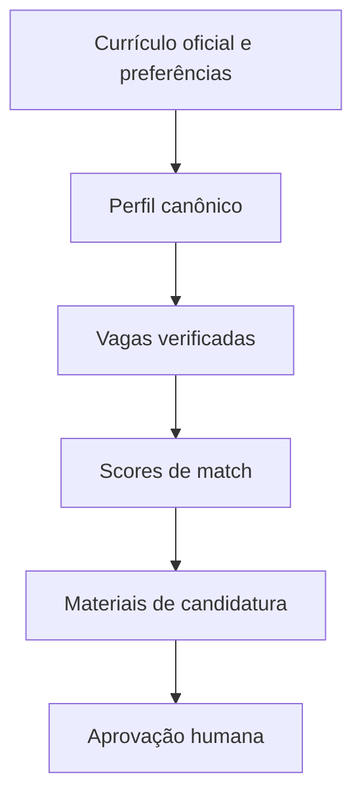

# Arquitetura do CareerOps AI

## Visão geral

O CareerOps AI aplica separação de responsabilidades. Cada skill produz ou valida um artefato antes de liberar a etapa seguinte.

## Componentes

### 1. Perfil profissional

Mantém fatos profissionais separados das regras de busca. Toda informação confirmada exige fonte e evidência.

### 2. Pesquisa e validação de vagas

Normaliza registros e verifica data, página original, link de candidatura, status, duplicidade, localidade, modalidade, senioridade e jornada.

### 3. Match profissional

Calcula aderência reproduzível por categorias. Competências não comprovadas não recebem pontuação.

### 4. Kit de candidatura

Verifica regras ATS, formatos de saída e consistência entre perfil, vaga, match e materiais.

### 5. Orquestração

Controla a ordem `profile -> jobs -> match -> bundle -> approval`. Dependências incompletas ou artefatos inválidos bloqueiam o avanço.

## Guardrails

- uma candidata por execução;
- nenhuma invenção de fatos profissionais;
- validação antes da próxima etapa;
- candidatura automática desativada;
- aprovação humana obrigatória;
- rastreabilidade por `candidate_id` e `run_id`.
